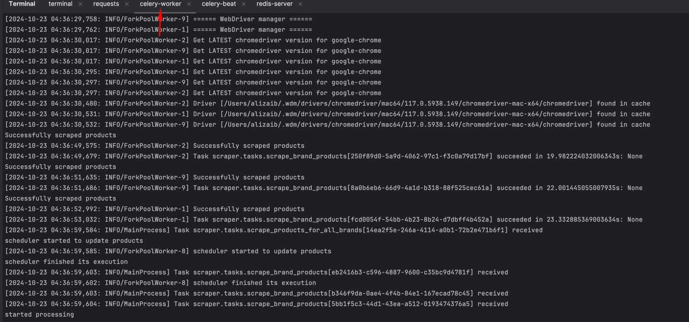

**Project Setup Guidelines**

Python verison: 3.11.5
1. create virtual enviroment
2. 

**About Project**

celery worker working on scheduler jobs

Celery beat for scheduled jobs

rabbit mq broker in docker container

rabbit mq dashboard for monitoring

creat a brand

view scraped products of listed brands
brand_id: 3

brand_id: 4

brand_id: 7

Curl format to scrap brand 7 products
` curl -X POST http://127.0.0.1:8000/brands/scrape/ \
-H "Content-Type: application/json" \
-d '{"brand_id": 7}'`

**DB Design with foreign key relation**

brand table

brand products

Django admin
brands

products

celery integration

celery beat integration for scheduler to update products 4 times a day

